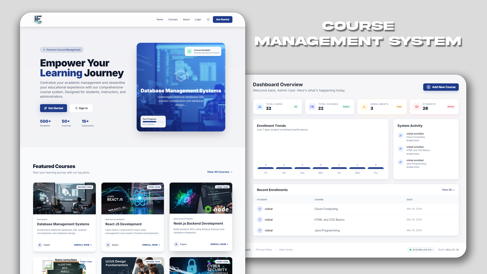

# EduManage — Premium Course Management System

  

  

  <strong>A high-performance, role-based educational platform for modern institutions.</strong>

  
  
  
  

---

## 🌟 Visual Preview

### 🖥️ Modern Experience

*Beautiful, high-conversion landing page with dynamic course listings.*

### 🎭 Multi-Role Dashboards
| Student Dashboard | Instructor Dashboard | Admin Dashboard |
| :---: | :---: | :---: |
|  |  |  |

### 🛠️ Core Management Tools
| Manage Courses | Manage Users | Enrollments |
| :---: | :---: | :---: |
|  |  |  |

### 🎓 Student Learning Experience
| Course Completion & Certification |
| :---: |
|  |
*Students get a beautiful course completion screen with certificate access upon finishing all lessons.*

---

## 🚀 Key Features

- 🔐 **Enterprise-Grade Auth** — Secure login/register with bcrypt hashing and session-level role protection.
- 👤 **Triple-Role Ecosystem** — Dedicated, feature-rich portals for Administrators, Instructors, and Students.
- 📚 **Course Lifecycle Management** — Complete CRUD operations with image processing and instant category filtering.
- 📊 **Real-time Analytics** — Visual trend charts, enrollment metrics, and live activity feeds for administrators.
- 🎓 **Student Experience** — One-click enrollment, personalized learning progress tracking, course completion certificates, and secure password management.
- 👨‍🏫 **Instructor Control** — Specialized tools to manage assigned students, track engagement, and update materials.
- 🌙 **Persistent Theming** — Seamless light/dark mode transition that remembers user preferences.
- 📱 **Fluid Responsiveness** — Pixel-perfect experience across mobile, tablet, and high-resolution desktops.
- 🎲 **Smart Randomization** — Advanced backend tools for automated instructor-course distribution and testing.

---

## 🛠️ Technical Stack

- **Core**: PHP 8.1+ (Procedural with PDO)
- **Database**: MySQL (Optimized with structured relationships)
- **Styling**: Vanilla Tailwind CSS + Modern Glassmorphism
- **Icons**: Google Material Symbols (High-fidelity)
- **Theming**: Dark/Light mode engine (Manual + System preference)

---

## 📄 License

**Copyright © 2026 Vishal Pawar. All Rights Reserved.**

This project is intended for personal review and portfolio evaluation. For any other use, modification, or redistribution, explicit permission must be obtained from the author. 

See [LICENSE](LICENSE) for full details.

---

© 2026 EduStream. Built with passion for modern education.
