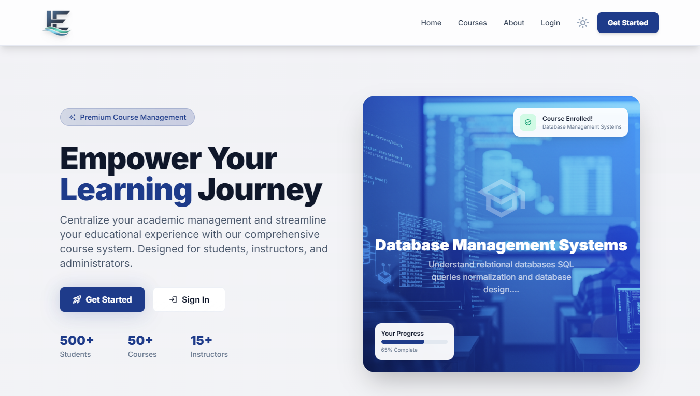

# EduManage — Premium Course Management System

<p align="center">
  
</p>

<p align="center">
  <strong>A high-performance, role-based educational platform for modern institutions.</strong>
</p>

<p align="center">
  
  
  
  
</p>

---

## 🌟 Visual Preview

### 🖥️ Modern Experience

*Beautiful, high-conversion landing page with dynamic course listings.*

### 🎭 Multi-Role Dashboards
| Student Dashboard | Instructor Dashboard | Admin Dashboard |
| :---: | :---: | :---: |
|  |  |  |

### 🛠️ Core Management Tools
| Manage Courses | Manage Users | Enrollments |
| :---: | :---: | :---: |
|  |  |  |

---

## 🚀 Key Features

- 🔐 **Enterprise-Grade Auth** — Secure login/register with bcrypt hashing and session-level role protection.
- 👤 **Triple-Role Ecosystem** — Dedicated, feature-rich portals for Administrators, Instructors, and Students.
- 📚 **Course Lifecycle Management** — Complete CRUD operations with image processing and instant category filtering.
- 📊 **Real-time Analytics** — Visual trend charts, enrollment metrics, and live activity feeds for administrators.
- 🎓 **Student Experience** — One-click enrollment, personalized learning progress tracking, and verified results.
- 👨‍🏫 **Instructor Control** — Specialized tools to manage assigned students, track engagement, and update materials.
- 🌙 **Persistent Theming** — Seamless light/dark mode transition that remembers user preferences.
- 📱 **Fluid Responsiveness** — Pixel-perfect experience across mobile, tablet, and high-resolution desktops.
- 🎲 **Smart Randomization** — Advanced backend tools for automated instructor-course distribution and testing.

---

## 🛠️ Technical Stack

- **Core**: PHP 8.1+ (Procedural with PDO)
- **Database**: MySQL (Optimized with structured relationships)
- **Styling**: Vanilla Tailwind CSS + Modern Glassmorphism
- **Icons**: Google Material Symbols (High-fidelity)
- **Theming**: Dark/Light mode engine (Manual + System preference)

---

## ⚙️ Quick Start Installation

### 📋 Prerequisites
- **XAMPP** (or any LAMP/WAMP stack)
- **PHP 8.0 or higher**

### 🔨 Setup Steps

1. **Clone the Project**:
   ```bash
   git clone https://github.com/vishal-dev1128/Course-Management-System-CMS-.git
   cd Course-Management-System-CMS-
   ```

2. **Database Configuration**:
   - Create a database named `cms_db`.
   - Import the seeder file located at `config/cms_db.sql`.

3. **Verify Connection**:
   Check `config/db.php` to ensure credentials match your environment:
   ```php
   define('DB_HOST', 'localhost');
   define('DB_NAME', 'cms_db');
   define('DB_USER', 'root');
   define('DB_PASS', '');
   ```

4. **Launch**:
   Start Apache and MySQL via XAMPP and visit:
   `http://localhost/CMS`

---

## 🔑 Access Credentials (Default Data)

| Role | Email | Password |
| :--- | :--- | :--- |
| **Administrator** | `admin@cms.com` | `admin_pass_2026` |
| **Instructor 1** | `vikram@cms.com` | `instructor123` |
| **Instructor 2** | `michael@cms.com` | `instructor123` |
| **Instructor 3** | `anita@cms.com` | `instructor123` |
| **Student** | `alice@cms.com` | `student123` |

---

## 🔒 Security Architecture

- **Security Policy**: Detailed vulnerability reporting guidelines are available in [SECURITY.md](SECURITY.md).
- **Hardened Headers**: Implemented `X-Frame-Options`, `X-Content-Type-Options`, and `Referrer-Policy` to prevent clickjacking and MIME-sniffing.
- **Credential Hashing**: Uses PHP `password_hash()` for state-of-the-art security.
- **SQL Injection Prevention**: Forced PDO prepared statements across all database interactions.
- **XSS Protection**: All user-generated content is sanitized via `htmlspecialchars()` and custom logic.
- **Access Control**: Strict `requireRole()` checks on every protected route.
- **File Security**: Strict extension whitelist and size validation for course assets.

---

## 📄 Documentation

For full product requirements and technical specifications, refer to [PRD.md](PRD.md).

---

© 2026 EduStream. Built with passion for modern education.
